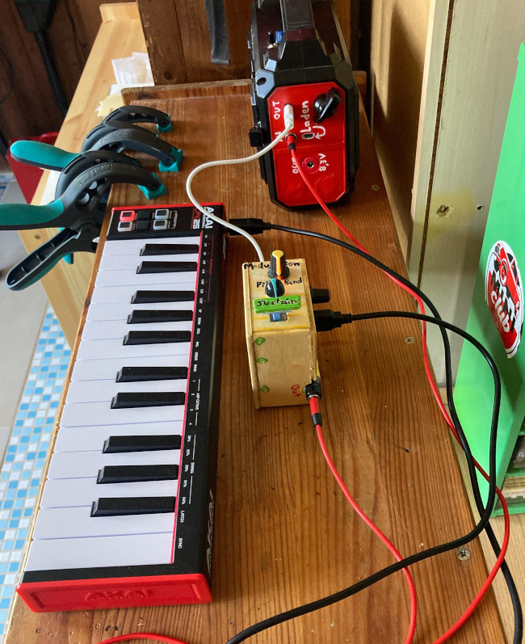

# 6bit PWM magic

Code Works with 5x 884 Ohm (10x 1800) and 7x 1800 Ohm R2R bridge
based on D2 (till D7). No final RC needed for good retro sound!

Do you want to upload it normal and not via usbasp? You have
to comment out the "upload_" parts in `platformio.ini`.

[Listen to the Audio File](https://raw.githubusercontent.com/no-go/miniMidiOut/refs/heads/arduino-uno/extra/example.m4a)

## Features

midi

- velocity (64 steps = 6bit)
- pitchbend (2 half tones)
- sustain
- hold and release
- multiple voices

hardware

- octave switch down (A3 to GND)
- additional sustain (A2 to GND)
- additional pitchbend (5V..A0..GND)
- modulation (5V..A4..GND)
- A1 is HIGH, if pitchbend is neutral
- A5 is HIGH, if modulation is neutral

## Known Bugs

- very 5V sensitive: sometimes MAX USB chip needs minutes or do not match to find device
- inital find USB-Client takes up to 5 minutes (use reset pin after 5min or reconnect USB)

Instead of using 5V from Arduino to power up the Shield USB port (VBUS) the MAX VBUS
Pin should be use. The initial inrush of a big MIDI Device (high inital current) should
be catched by a 470uF Elko and a skotty diode (1N5819, DO-42, SS14, SS14A SB140, 1N5817, 1N5818).
Diode should be between MAX Chip and +5V Vbus.
